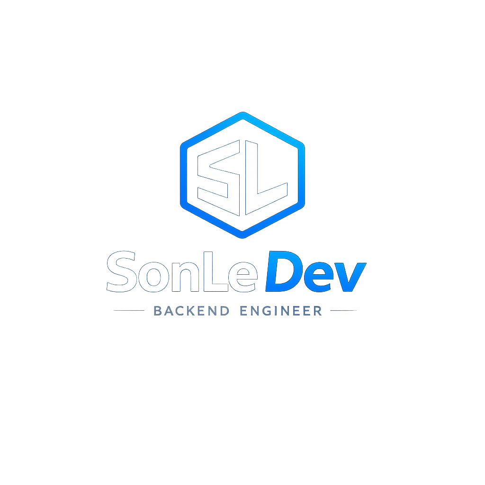

<div align="center">




# LÊ HỒNG SƠN

### Backend Engineer Student


<br>


</div>

---

````markdown


# About

I'm an Information Technology student focused on Backend Development.

My interests include:

- Backend Engineering
- Database Design
- RESTful API Development
- Software Architecture
- System Design

Current goal:

```java
Backend Engineer Internship
````

---

# Technical Focus

```text
Java • Spring Boot • PostgreSQL • REST API • Git • Docker
```

---

# Architecture

```text
┌─────────────────────────────────────────────┐
│                 CLIENT LAYER                │
│              Web / Mobile Apps              │
└─────────────────────┬───────────────────────┘
                      │
                      ▼
┌─────────────────────────────────────────────┐
│                 REST API                    │
│                Spring Boot                  │
└─────────────────────┬───────────────────────┘
                      │
         ┌────────────┴────────────┐
         ▼                         ▼

 Authentication              Business Logic
 Spring Security            Service Layer

         └────────────┬────────────┘
                      ▼

               PostgreSQL
              Data Storage
```
---

# Current Stack

### Working With

* Java Core
* PostgreSQL
* Database Design
* SQL

### Currently Learning

* Spring Boot
* REST API Development

### Learning Next

* Spring Security
* JWT Authentication
* Docker
* AWS

---


# Current Project

## Rental Management Platform

Backend-oriented project focused on:

* Layered Architecture
* RESTful API Design
* Database Modeling
* Authentication & Authorization
* Transaction Management
* Deployment Workflow

---

# Learning Roadmap

```text
Java Core
    │
    ▼
Spring Boot
    │
    ▼
REST API
    │
    ▼
Spring Security
    │
    ▼
JWT Authentication
    │
    ▼
Docker
    │
    ▼
AWS
    │
    ▼
Backend Engineer
```

---

# GitHub Analytics

<div align="center">


</div>

---

# Activity Graph

<div align="center">


</div>

---

# Engineering Philosophy

```java
public class Engineer {

    public static void main(String[] args) {

        while (!mastery) {

            learn();

            build();

            refactor();

            improve();

        }
    }
}
```

---

# Contact

### GitHub

https://github.com/sonle-dev

### Email

[lehongson270920050@gmail.com](mailto:lehongson270920050@gmail.com)

---

<div align="center">

### BUILD • TEST • DEPLOY • IMPROVE

Backend Engineering Journey

</div>
```

